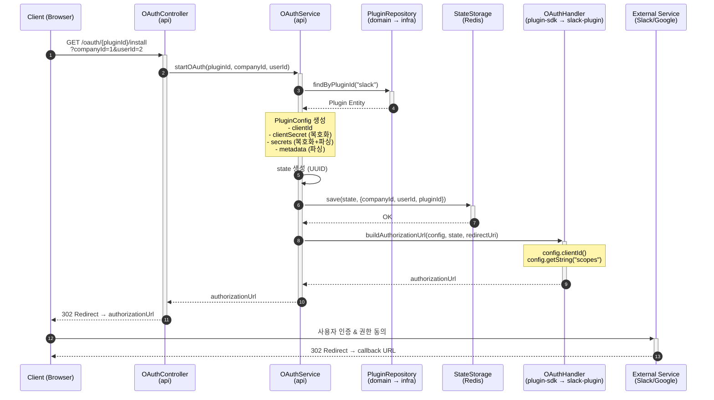
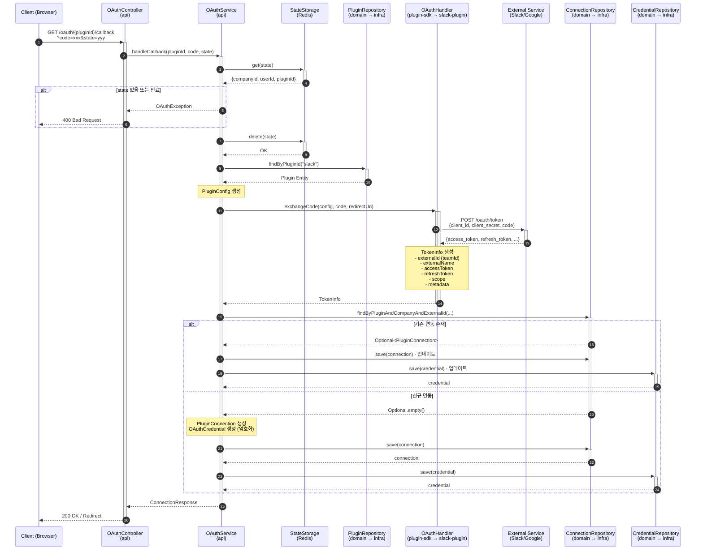
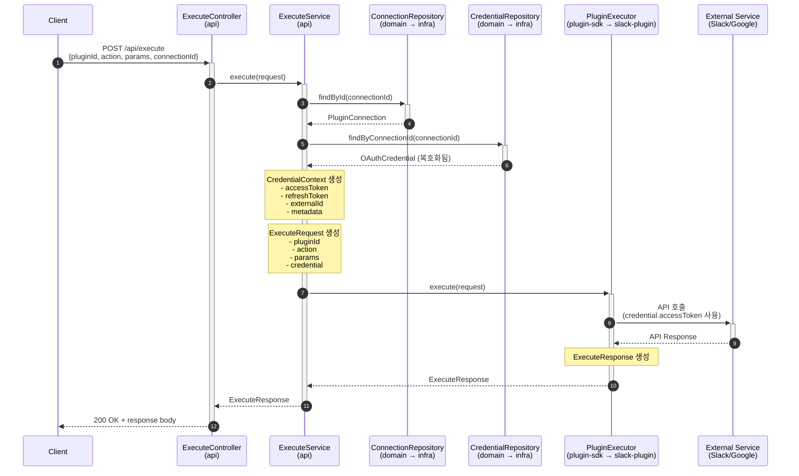

# 플러그인 인터페이스 설계

## 개요

Server ↔ Plugin 간 데이터 교환 패턴 및 인터페이스 설계

---

## 1. 현재 문제점

### 1.1 설정 관리 분리

```
현재 구조:
┌────────────────┐     ┌──────────────────┐
│   Server       │     │   Plugin         │
│                │     │                  │
│ plugin 테이블  │     │ slack.properties │
│ - client_id    │     │ - client_id      │
│ - client_secret│     │ - client_secret  │
└────────────────┘     └──────────────────┘
       ↑                     ↑
       └─── 이중 관리 ───────┘
```

- 동일 정보가 DB와 플러그인 properties에 중복
- 환경별 설정 관리 복잡
- 플러그인 추가 시마다 설정 파일 필요

### 1.2 Slack 특화 인터페이스

```java
// 현재 ExecuteRequest - Slack 전용 필드
public record ExecuteRequest(
    String plugin,
    String method,
    String uri,
    String body,
    String teamId,      // ← Slack 전용
    String accessToken
) {}
```

---

## 2. 설계 원칙

### 2.1 Single Source of Truth

- 플러그인 설정은 DB(`plugin` 테이블)에서만 관리
- 서버가 플러그인에 설정 주입
- 플러그인은 properties 파일 불필요

### 2.2 플러그인 Stateless

- 플러그인은 상태(설정)를 내부에 저장하지 않음
- 매 요청 시 필요한 정보를 서버로부터 전달받음
- 인스턴스 공유 가능, 확장성 확보

### 2.3 범용적 인터페이스

- 특정 플러그인(Slack)에 종속되지 않는 DTO
- `Map<String, Object>` 또는 JSON으로 확장 가능한 필드

---

## 3. 핵심 DTO 설계

### 3.1 PluginConfig (서버 → 플러그인)

OAuth 처리에 필요한 플러그인 설정 정보

```java
/**
 * 플러그인 설정 정보
 * DB의 plugin 테이블에서 조회하여 전달
 */
public record PluginConfig(
    String pluginId,            // 플러그인 식별자 (slack, google, etc.)
    String clientId,            // OAuth Client ID
    String clientSecret,        // OAuth Client Secret (복호화됨)
    Map<String, String> secrets,    // 추가 민감 정보 (signing_secret 등)
    Map<String, Object> metadata    // 설정 정보 (scopes, authUrl, tokenUrl 등)
) {
    // metadata에서 값 조회 헬퍼
    public String getString(String key) {
        return metadata.get(key) != null ? metadata.get(key).toString() : null;
    }

    public List<String> getStringList(String key) {
        Object value = metadata.get(key);
        if (value instanceof List) {
            return ((List<?>) value).stream()
                .map(Object::toString)
                .toList();
        }
        return List.of();
    }
}
```

**DB 매핑**:
```
plugin 테이블         →  PluginConfig
─────────────────────────────────────
plugin_id            →  pluginId
client_id            →  clientId
client_secret        →  clientSecret (복호화)
secrets (JSON)       →  secrets (복호화 후 파싱)
metadata (JSON)      →  metadata (파싱)
```

### 3.2 CredentialContext (서버 → 플러그인)

API 실행에 필요한 인증 정보

```java
/**
 * API 실행용 인증 정보
 * DB의 oauth_credential/apikey_credential 테이블에서 조회
 */
public record CredentialContext(
    String accessToken,             // OAuth Access Token (복호화됨)
    String refreshToken,            // OAuth Refresh Token (복호화됨, nullable)
    String apiKey,                  // API Key (복호화됨, OAuth면 null)
    Instant expiresAt,              // 토큰 만료 시간 (nullable)
    String externalId,              // 외부 시스템 ID (teamId, tenantId 등)
    Map<String, String> metadata    // 추가 정보 (botUserId 등)
) {
    public boolean isExpired() {
        return expiresAt != null && Instant.now().isAfter(expiresAt);
    }

    public String getMetadata(String key) {
        return metadata != null ? metadata.get(key) : null;
    }
}
```

### 3.3 ExecuteRequest 개선

```java
/**
 * 플러그인 API 실행 요청 (범용)
 */
public record ExecuteRequest(
    String pluginId,                // 플러그인 식별자
    String action,                  // 실행할 액션 (chat.postMessage, send-email 등)
    Map<String, Object> params,     // 액션 파라미터
    CredentialContext credential    // 인증 정보
) {
    // 파라미터 접근 헬퍼
    public String getStringParam(String key) {
        return params.get(key) != null ? params.get(key).toString() : null;
    }

    public <T> T getParam(String key, Class<T> type) {
        Object value = params.get(key);
        return type.isInstance(value) ? type.cast(value) : null;
    }
}
```

**변경 사항**:
| 기존 | 개선 |
|------|------|
| `plugin` | `pluginId` (명확한 네이밍) |
| `method` + `uri` | `action` (하나의 식별자로 통합) |
| `body` (JSON String) | `params` (Map으로 파싱 완료) |
| `teamId` | `credential.externalId` (범용) |
| `accessToken` | `credential.accessToken` (구조화) |

---

## 4. 인터페이스 개선

### 4.1 OAuthHandler 개선

```java
/**
 * OAuth 처리 인터페이스 (V2)
 */
public interface OAuthHandler extends ExtensionPoint {

    /**
     * 플러그인 ID
     */
    String getPluginId();

    /**
     * OAuth 인증 URL 생성
     *
     * @param config 플러그인 설정 (서버가 DB에서 조회하여 전달)
     * @param state CSRF 방지용 state
     * @param redirectUri 콜백 URL
     * @return 인증 URL
     */
    String buildAuthorizationUrl(PluginConfig config, String state, String redirectUri);

    /**
     * 인증 코드로 토큰 교환
     *
     * @param config 플러그인 설정
     * @param code 인증 코드
     * @param redirectUri 콜백 URL
     * @return 토큰 정보
     */
    TokenInfo exchangeCode(PluginConfig config, String code, String redirectUri)
        throws OAuthException;

    /**
     * 토큰 갱신 (선택적 구현)
     *
     * @param config 플러그인 설정
     * @param refreshToken 리프레시 토큰
     * @return 새 토큰 정보
     */
    default TokenInfo refreshToken(PluginConfig config, String refreshToken)
        throws OAuthException {
        throw new UnsupportedOperationException("Token refresh not supported");
    }

    /**
     * 토큰 폐기 (선택적 구현)
     */
    default void revokeToken(PluginConfig config, String accessToken)
        throws OAuthException {
        // 기본: 아무것도 안함
    }
}
```

### 4.2 PluginExecutor 개선

```java
/**
 * 플러그인 API 실행 인터페이스 (V2)
 */
public interface PluginExecutor extends ExtensionPoint {

    /**
     * 플러그인 ID
     */
    String getPluginId();

    /**
     * 지원하는 액션 목록
     */
    List<String> getSupportedActions();

    /**
     * API 실행
     *
     * @param request 실행 요청 (credential 포함)
     * @return 실행 결과
     */
    ExecuteResponse execute(ExecuteRequest request);

    /**
     * 액션 지원 여부 확인
     */
    default boolean supportsAction(String action) {
        return getSupportedActions().contains(action);
    }
}
```

---

## 5. 데이터 흐름 (Sequence Diagram)

### 5.1 OAuth 설치 플로우



### 5.2 OAuth 콜백 플로우



### 5.3 API 실행 플로우



---

## 6. 플러그인 구현 예시

### 6.1 SlackOAuthHandler (개선)

```java
@Extension
public class SlackOAuthHandler implements OAuthHandler {

    private static final String PLUGIN_ID = "slack";
    private static final String AUTH_URL = "https://slack.com/oauth/v2/authorize";

    private final Slack slack = Slack.getInstance();

    @Override
    public String getPluginId() {
        return PLUGIN_ID;
    }

    @Override
    public String buildAuthorizationUrl(PluginConfig config, String state, String redirectUri) {
        // config에서 설정 조회 (DB에서 전달받음)
        String clientId = config.clientId();
        String scopes = config.getString("scopes");

        return AUTH_URL +
            "?client_id=" + encode(clientId) +
            "&scope=" + encode(scopes) +
            "&redirect_uri=" + encode(redirectUri) +
            "&state=" + encode(state);
    }

    @Override
    public TokenInfo exchangeCode(PluginConfig config, String code, String redirectUri)
            throws OAuthException {
        try {
            // config에서 clientId/clientSecret 사용
            OAuthV2AccessResponse response = slack.methods().oauthV2Access(r -> r
                .clientId(config.clientId())
                .clientSecret(config.clientSecret())
                .redirectUri(redirectUri)
                .code(code)
            );

            if (!response.isOk()) {
                throw new OAuthException("SLACK_ERROR", response.getError());
            }

            return TokenInfo.builder()
                .pluginId(PLUGIN_ID)
                .externalId(response.getTeam().getId())
                .externalName(response.getTeam().getName())
                .accessToken(response.getAccessToken())
                .refreshToken(response.getRefreshToken())
                .scope(response.getScope())
                .metadata(Map.of(
                    "botUserId", response.getBotUserId(),
                    "appId", response.getAppId()
                ))
                .build();

        } catch (Exception e) {
            throw new OAuthException("TOKEN_EXCHANGE_FAILED", e.getMessage(), e);
        }
    }
}
```

### 6.2 SlackPluginExecutor (개선)

```java
@Extension
public class SlackPluginExecutor implements PluginExecutor {

    private static final String PLUGIN_ID = "slack";
    private static final List<String> SUPPORTED_ACTIONS = List.of(
        "chat.postMessage",
        "conversations.list",
        "users.list"
    );

    private final Slack slack = Slack.getInstance();

    @Override
    public String getPluginId() {
        return PLUGIN_ID;
    }

    @Override
    public List<String> getSupportedActions() {
        return SUPPORTED_ACTIONS;
    }

    @Override
    public ExecuteResponse execute(ExecuteRequest request) {
        CredentialContext credential = request.credential();

        if (credential == null || credential.accessToken() == null) {
            return ExecuteResponse.error(401, "Access token required");
        }

        if (credential.isExpired()) {
            return ExecuteResponse.error(401, "Token expired");
        }

        return switch (request.action()) {
            case "chat.postMessage" -> handleChatPostMessage(request, credential);
            case "conversations.list" -> handleConversationsList(credential);
            case "users.list" -> handleUsersList(credential);
            default -> ExecuteResponse.error(400, "Unsupported action: " + request.action());
        };
    }

    private ExecuteResponse handleChatPostMessage(ExecuteRequest request, CredentialContext credential) {
        try {
            String channel = request.getStringParam("channel");
            String text = request.getStringParam("text");

            MethodsClient methods = slack.methods(credential.accessToken());
            ChatPostMessageResponse response = methods.chatPostMessage(r -> r
                .channel(channel)
                .text(text)
            );

            return response.isOk()
                ? ExecuteResponse.success(200, toJson(response))
                : ExecuteResponse.error(400, response.getError());

        } catch (Exception e) {
            return ExecuteResponse.error(500, e.getMessage());
        }
    }

    private ExecuteResponse handleConversationsList(CredentialContext credential) {
        try {
            MethodsClient methods = slack.methods(credential.accessToken());
            ConversationsListResponse response = methods.conversationsList(r -> r
                .types(List.of(ConversationType.PUBLIC_CHANNEL, ConversationType.PRIVATE_CHANNEL))
                .excludeArchived(true)
            );

            return response.isOk()
                ? ExecuteResponse.success(200, toJson(response))
                : ExecuteResponse.error(400, response.getError());

        } catch (Exception e) {
            return ExecuteResponse.error(500, e.getMessage());
        }
    }
}
```

---

## 7. 플러그인 metadata 스키마

### 7.1 plugin 테이블 metadata 예시

```json
// Slack
{
  "scopes": "channels:read,chat:write,users:read",
  "authUrl": "https://slack.com/oauth/v2/authorize",
  "tokenUrl": "https://slack.com/api/oauth.v2.access",
  "userScopes": "identity.basic"
}

// Google Workspace
{
  "scopes": "https://www.googleapis.com/auth/gmail.send",
  "authUrl": "https://accounts.google.com/o/oauth2/v2/auth",
  "tokenUrl": "https://oauth2.googleapis.com/token",
  "accessType": "offline",
  "prompt": "consent"
}

// Jira (API Key)
{
  "baseUrl": "https://your-domain.atlassian.net",
  "apiVersion": "3"
}
```

### 7.2 plugin 테이블 secrets 예시

```json
// Slack
{
  "signing_secret": "xxx..."
}

// MS Teams
{
  "tenant_secret": "xxx...",
  "webhook_secret": "xxx..."
}
```

### 7.3 oauth_credential metadata 예시

```json
// Slack
{
  "botUserId": "U0123456789",
  "appId": "A0123456789",
  "enterpriseId": "E0123456789"
}

// Google
{
  "email": "user@gmail.com",
  "userId": "123456789"
}
```

---

## 8. plugin-sdk 모듈

### 8.1 개요

플러그인 개발에 필요한 인터페이스와 DTO를 제공하는 독립 모듈

- **위치**: `plugins/plugin-sdk/`
- **목적**: 외부 개발자가 JAR만 의존하여 플러그인 개발 가능
- **배포**: Maven Central 또는 내부 Nexus

### 8.2 모듈 구조

```
server/
├── dop-global-apps-core/           # 내부 유틸리티 (plugin-sdk 의존)
├── dop-global-apps-domain/
├── dop-global-apps-infrastructure/
├── dop-global-apps-api/            # plugin-sdk 의존
│
└── plugins/
    ├── plugin-sdk/                 # 🆕 플러그인 공통 SDK
    │   └── src/main/java/
    │       └── com/daou/dop/global/apps/plugin/sdk/
    │           ├── PluginExecutor.java
    │           ├── OAuthHandler.java
    │           ├── OAuthException.java
    │           ├── PluginConfig.java
    │           ├── CredentialContext.java
    │           ├── ExecuteRequest.java
    │           ├── ExecuteResponse.java
    │           └── TokenInfo.java
    │
    ├── slack-plugin/               # plugin-sdk 의존
    └── google-plugin/              # plugin-sdk 의존
```

### 8.3 패키지 구조

```
com.daou.dop.global.apps.plugin.sdk/
├── PluginExecutor.java             # API 실행 인터페이스
├── OAuthHandler.java               # OAuth 처리 인터페이스
├── OAuthException.java             # OAuth 예외
│
├── PluginConfig.java               # 서버→플러그인 (설정)
├── CredentialContext.java          # 서버→플러그인 (인증정보)
├── ExecuteRequest.java             # API 실행 요청
├── ExecuteResponse.java            # API 실행 응답
└── TokenInfo.java                  # 플러그인→서버 (토큰)
```

### 8.4 의존성 관계

```
                    ┌─────────────────┐
                    │   plugin-sdk    │  ← JAR 배포 (외부 개발자용)
                    │  (인터페이스/DTO) │
                    └────────┬────────┘
                             │
        ┌────────────────────┼────────────────────┐
        │                    │                    │
        ▼                    ▼                    ▼
  ┌───────────┐       ┌───────────┐       ┌─────────────┐
  │slack-plugin│       │google-plugin│      │ 외부 플러그인 │
  └─────┬─────┘       └─────┬─────┘       └─────────────┘
        │                   │
        └─────────┬─────────┘
                  │ runtimeOnly
                  ▼
        ┌─────────────────────┐
        │  dop-global-apps-api │
        │  (plugin-sdk 의존)   │
        └─────────────────────┘
```

### 8.5 Gradle 설정

```groovy
// plugins/plugin-sdk/build.gradle
plugins {
    id 'java-library'
    id 'maven-publish'
}

group = 'com.daou.dop'
version = '1.0.0'

dependencies {
    compileOnly 'org.pf4j:pf4j:3.14.1'
    // Spring 의존성 없음!
}

publishing {
    publications {
        maven(MavenPublication) {
            from components.java
            artifactId = 'plugin-sdk'
        }
    }
}
```

```groovy
// plugins/slack-plugin/build.gradle
dependencies {
    compileOnly project(':plugins:plugin-sdk')
    compileOnly 'org.pf4j:pf4j:3.14.1'
    implementation 'com.slack.api:bolt:1.44.2'
}
```

```groovy
// dop-global-apps-api/build.gradle
dependencies {
    implementation project(':plugins:plugin-sdk')
    runtimeOnly project(':plugins:slack-plugin')
}
```

### 8.6 외부 개발자 가이드

**1. 의존성 추가**

```groovy
// 외부 개발자 build.gradle
plugins {
    id 'java'
}

repositories {
    mavenCentral()
    // 또는 내부 Nexus
    maven { url 'https://nexus.daou.com/repository/maven-public/' }
}

dependencies {
    compileOnly 'com.daou.dop:plugin-sdk:1.0.0'
    compileOnly 'org.pf4j:pf4j:3.14.1'

    // 플러그인 자체 의존성
    implementation 'your.external:library:1.0.0'
}
```

**2. 플러그인 구현**

```java
// MyPlugin.java
public class MyPlugin extends Plugin {
    public MyPlugin(PluginWrapper wrapper) {
        super(wrapper);
    }
}

// MyOAuthHandler.java
@Extension
public class MyOAuthHandler implements OAuthHandler {

    @Override
    public String getPluginId() {
        return "my-plugin";
    }

    @Override
    public String buildAuthorizationUrl(PluginConfig config, String state, String redirectUri) {
        // config에서 clientId, metadata 사용
        return "https://my-service.com/oauth/authorize?client_id=" + config.clientId();
    }

    @Override
    public TokenInfo exchangeCode(PluginConfig config, String code, String redirectUri) {
        // 토큰 교환 구현
    }
}

// MyPluginExecutor.java
@Extension
public class MyPluginExecutor implements PluginExecutor {

    @Override
    public String getPluginId() {
        return "my-plugin";
    }

    @Override
    public List<String> getSupportedActions() {
        return List.of("send-message", "get-users");
    }

    @Override
    public ExecuteResponse execute(ExecuteRequest request) {
        // API 실행 구현
    }
}
```

**3. plugin.properties 작성**

```properties
plugin.id=my-plugin
plugin.class=com.example.MyPlugin
plugin.version=1.0.0
plugin.provider=Example Inc
plugin.description=My custom plugin
```

**4. JAR 빌드 및 배포**

```bash
./gradlew build
# build/libs/my-plugin-1.0.0.jar 생성

# JAR를 서버의 plugins 디렉토리에 복사
cp build/libs/my-plugin-1.0.0.jar /path/to/server/plugins/
```

### 8.7 core 모듈과의 관계

```
┌─────────────────────────────────────────────────────────────┐
│                       plugins/plugin-sdk                     │
│                                                             │
│  외부 공개: 인터페이스, DTO                                   │
│  - PluginExecutor, OAuthHandler                             │
│  - PluginConfig, CredentialContext, ExecuteRequest, etc.    │
└─────────────────────────────────────────────────────────────┘
                              ▲
                              │ 의존
┌─────────────────────────────┴───────────────────────────────┐
│                     dop-global-apps-core                     │
│                                                             │
│  내부 전용: 유틸리티, 헬퍼                                    │
│  - 암호화 유틸 (plugin-sdk에서 분리)                          │
│  - 내부 공통 로직                                            │
└─────────────────────────────────────────────────────────────┘
```

- **plugin-sdk**: 플러그인 개발에 필요한 최소한의 인터페이스/DTO만 포함
- **core**: 서버 내부에서만 사용하는 유틸리티 (암호화 등)

---

## 9. 마이그레이션 전략

### 9.1 단계별 전환

1. **Phase 1**: 새 DTO 추가 (기존과 공존)
   - `PluginConfig`, `CredentialContext` 추가
   - 기존 인터페이스 유지

2. **Phase 2**: 인터페이스 V2 추가
   - `OAuthHandlerV2`, `PluginExecutorV2` 추가
   - V1은 deprecated 처리

3. **Phase 3**: 플러그인 마이그레이션
   - Slack 플러그인 V2 구현
   - properties 파일 제거

4. **Phase 4**: V1 인터페이스 제거

### 9.2 하위 호환성

```java
// V1 어댑터 (기존 플러그인 지원)
public class OAuthHandlerV1Adapter implements OAuthHandlerV2 {
    private final OAuthHandler v1Handler;
    private final PluginConfig config;

    @Override
    public String buildAuthorizationUrl(PluginConfig config, String state, String redirectUri) {
        // V1은 config 무시 (내부 properties 사용)
        return v1Handler.buildAuthorizationUrl(state, redirectUri);
    }
}
```

---

## 10. 변경 이력

| 날짜 | 버전 | 내용 |
|------|------|------|
| 2025-01-21 | 0.1 | 초안 작성 |
| 2025-01-21 | 0.2 | plugin-sdk 모듈 구조 추가, 외부 개발자 가이드 추가 |
| 2025-01-21 | 0.3 | 데이터 흐름 섹션 Mermaid Sequence Diagram으로 변경 |
