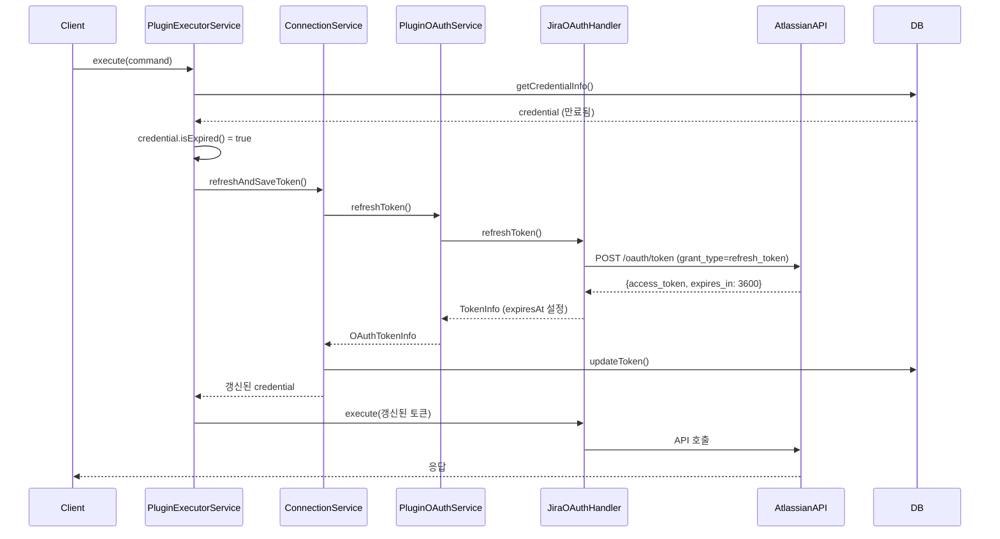

# OAuth 토큰 자동 갱신

## 개요

OAuth access token 만료 시 자동으로 갱신하는 기능

### 배경

- Jira(Atlassian) access token 유효기간: **1시간 (3600초)**
- 만료된 토큰으로 API 호출 시 401 Unauthorized 발생
- refresh token을 사용하여 새 access token 발급 필요

## 구현 방식

### Lazy Refresh (요청 시점 갱신)

- 별도 배치잡/스케줄러 없음
- API 요청 시점에 토큰 만료 확인
- 만료 시 즉시 갱신 후 요청 실행

### 장점

| 항목 | 설명 |
|------|------|
| 단순함 | 별도 스케줄러 불필요 |
| 효율성 | 실제 사용 시점에만 갱신 |
| 무상태 | 서버 재시작해도 동작 |
| 확장성 | 모든 OAuth 플러그인에 적용 가능 |

## 아키텍처

### 시퀀스 다이어그램



### 컴포넌트 구조

```
┌─────────────────────────────────────────────────────────────┐
│                    PluginExecutorService                    │
│  - enrichWithCredential()에서 만료 확인                       │
│  - 만료 시 ConnectionService.refreshAndSaveToken() 호출      │
└─────────────────────────────────────────────────────────────┘
                              │
                              ▼
┌─────────────────────────────────────────────────────────────┐
│                     ConnectionService                        │
│  - refreshAndSaveToken(): 토큰 갱신 + DB 저장                 │
│  - PluginOAuthService 호출                                   │
└─────────────────────────────────────────────────────────────┘
                              │
                              ▼
┌─────────────────────────────────────────────────────────────┐
│                    PluginOAuthService                        │
│  (interface, 구현체: PluginRegistry)                         │
│  - refreshToken(): OAuthHandler 호출 + 결과 변환             │
└─────────────────────────────────────────────────────────────┘
                              │
                              ▼
┌─────────────────────────────────────────────────────────────┐
│                      OAuthHandler                            │
│  (plugin-sdk interface, 구현체: JiraOAuthHandler)            │
│  - refreshToken(): 외부 OAuth 서버에 토큰 갱신 요청           │
└─────────────────────────────────────────────────────────────┘
```

## 주요 코드

### 1. 만료 여부 확인

**파일**: `dop-global-apps-core/.../dto/CredentialInfo.java`

```java
/**
 * 토큰 만료 여부 확인
 * - expiresAt이 NULL이고 refreshToken이 있으면 만료된 것으로 간주 (기존 연동 호환)
 * - expiresAt이 있으면 실제 만료 여부 확인
 */
public boolean isExpired() {
    if (expiresAt == null) {
        // expiresAt 없지만 refreshToken 있으면 갱신 필요 (기존 연동)
        return refreshToken != null && !refreshToken.isBlank();
    }
    return Instant.now().isAfter(expiresAt);
}
```

#### 만료 판정 로직

| 조건 | 결과 | 설명 |
|------|------|------|
| `expiresAt=NULL`, `refreshToken=있음` | **만료** | 기존 연동 호환 (갱신 시도) |
| `expiresAt=NULL`, `refreshToken=없음` | 만료 아님 | API Key 방식 등 |
| `expiresAt=과거` | **만료** | 실제 만료 |
| `expiresAt=미래` | 만료 아님 | 유효한 토큰 |

### 2. 요청 시점 갱신

**파일**: `dop-global-apps-core/.../execute/PluginExecutorService.java`

```java
private ExecuteRequest enrichWithCredential(ExecuteRequest request) {
    // ... credential 조회 ...

    // 토큰 만료 확인 및 갱신
    if (credential.isExpired()) {
        log.info("Token expired for plugin={}, externalId={}, attempting refresh",
                 pluginId, externalId);
        Optional<CredentialInfo> refreshed =
            connectionService.refreshAndSaveToken(pluginId, externalId);
        if (refreshed.isPresent()) {
            credential = refreshed.get();
        }
    }

    // 갱신된 credential로 요청 생성
    return ExecuteRequest.builder()
            .pluginId(request.pluginId())
            .action(request.action())
            .params(request.params())
            .credential(toCredentialContext(credential))
            .build();
}
```

### 3. 토큰 갱신 및 저장

**파일**: `dop-global-apps-core/.../connection/ConnectionService.java`

```java
@Transactional
public Optional<CredentialInfo> refreshAndSaveToken(String pluginId, String externalId) {
    // 1. Connection, Credential 조회
    // 2. Plugin Config 조회
    // 3. PluginOAuthService.refreshToken() 호출
    // 4. DB 업데이트
    // 5. 갱신된 CredentialInfo 반환
}
```

### 4. expires_in 파싱 (Jira)

**파일**: `plugins/jira-plugin/.../JiraOAuthHandler.java`

```java
// exchangeCode(), refreshToken() 공통
int expiresIn = tokenJson.has("expires_in") ? tokenJson.get("expires_in").asInt() : 3600;
Instant expiresAt = Instant.now().plusSeconds(expiresIn);

return TokenInfo.builder()
        .accessToken(accessToken)
        .refreshToken(refreshToken)
        .expiresAt(expiresAt)  // 만료 시간 설정
        .build();
```

## 수정 파일 목록

| 파일 | 변경 내용 |
|------|----------|
| `CredentialInfo.java` | `isExpired()` 로직 수정 (기존 연동 호환) |
| `JiraOAuthHandler.java` | `expires_in` 파싱 → `expiresAt` 설정 |
| `PluginOAuthService.java` | `refreshToken()` 메서드 추가 |
| `PluginRegistry.java` | `refreshToken()` 구현 |
| `ConnectionService.java` | `refreshAndSaveToken()` 추가 |
| `PluginExecutorService.java` | 만료 확인 및 자동 갱신 로직 |

## 검증 방법

### 1. DB에서 expires_at 확인

```sql
SELECT c.plugin_id, c.external_id, cr.expires_at
FROM plugin_connections c
JOIN oauth_credentials cr ON c.id = cr.connection_id
WHERE c.plugin_id = 'jira';
```

### 2. 로그 확인

토큰 갱신 시 출력되는 로그:

```
INFO  - Token expired for plugin=jira, externalId=xxx, attempting refresh
INFO  - Refreshing token for plugin=jira, externalId=xxx
INFO  - Successfully refreshed Jira token, expires in 3600 seconds
INFO  - Token refreshed successfully for plugin=jira, externalId=xxx
```

### 3. 수동 테스트

1. Jira 연동 완료
2. DB에서 `expires_at`을 과거 시간으로 변경
3. API 호출 → 자동 갱신 확인
4. DB에서 `expires_at` 갱신 확인

## 타임라인 예시

```
09:00  Jira 연동 완료
       - access_token 발급
       - expires_at = 10:00 (1시간 후)

09:30  API 호출
       - isExpired() = false
       - 기존 토큰으로 요청

10:30  API 호출
       - isExpired() = true
       - refreshAndSaveToken() 호출
       - 새 토큰 발급 (expires_at = 11:30)
       - 새 토큰으로 요청

11:00  API 호출
       - isExpired() = false
       - 기존 토큰으로 요청
```

## 다른 플러그인 적용

### 요구사항

1. `OAuthHandler.refreshToken()` 구현
2. 토큰 응답에서 `expires_in` 파싱하여 `expiresAt` 설정

### 예시 (Google Calendar)

```java
@Override
public TokenInfo refreshToken(PluginConfig config, String refreshToken) throws OAuthException {
    // Google OAuth 토큰 갱신 API 호출
    // expires_in 파싱 (Google 기본값: 3600초)
    int expiresIn = json.has("expires_in") ? json.get("expires_in").asInt() : 3600;
    Instant expiresAt = Instant.now().plusSeconds(expiresIn);

    return TokenInfo.builder()
            .accessToken(newAccessToken)
            .refreshToken(newRefreshToken)
            .expiresAt(expiresAt)
            .build();
}
```

## 기존 연동 호환성

### 문제

- 기능 배포 전 생성된 연동: DB에 `expires_at = NULL`
- 기존 `isExpired()` 로직: `expiresAt == NULL` → `false` (만료 아님)
- 실제로는 토큰 만료 → 401 에러 발생

### 해결

`isExpired()` 로직 수정:
- `expiresAt == NULL`이고 `refreshToken`이 있으면 **만료된 것으로 간주**
- 첫 요청 시 자동 갱신 → `expires_at` DB에 저장
- 이후 정상 동작

### 동작 흐름 (기존 연동)

```
1. 기존 연동 (expires_at = NULL, refresh_token = 있음)
2. API 요청
3. isExpired() = true (refreshToken 있으므로)
4. refreshAndSaveToken() 호출
5. 새 토큰 발급 + expires_at 저장
6. 이후 정상 만료 체크 동작
```

## 에러 처리

| 상황 | 동작 |
|------|------|
| refresh_token 없음 | 갱신 실패, 기존(만료된) 토큰으로 시도 |
| 갱신 API 실패 | 갱신 실패, 기존(만료된) 토큰으로 시도 |
| refresh_token 만료 | 갱신 실패, 사용자 재인증 필요 |

> **Note**: refresh_token 만료 시 사용자에게 재인증 요청 UI 필요 (향후 구현)
