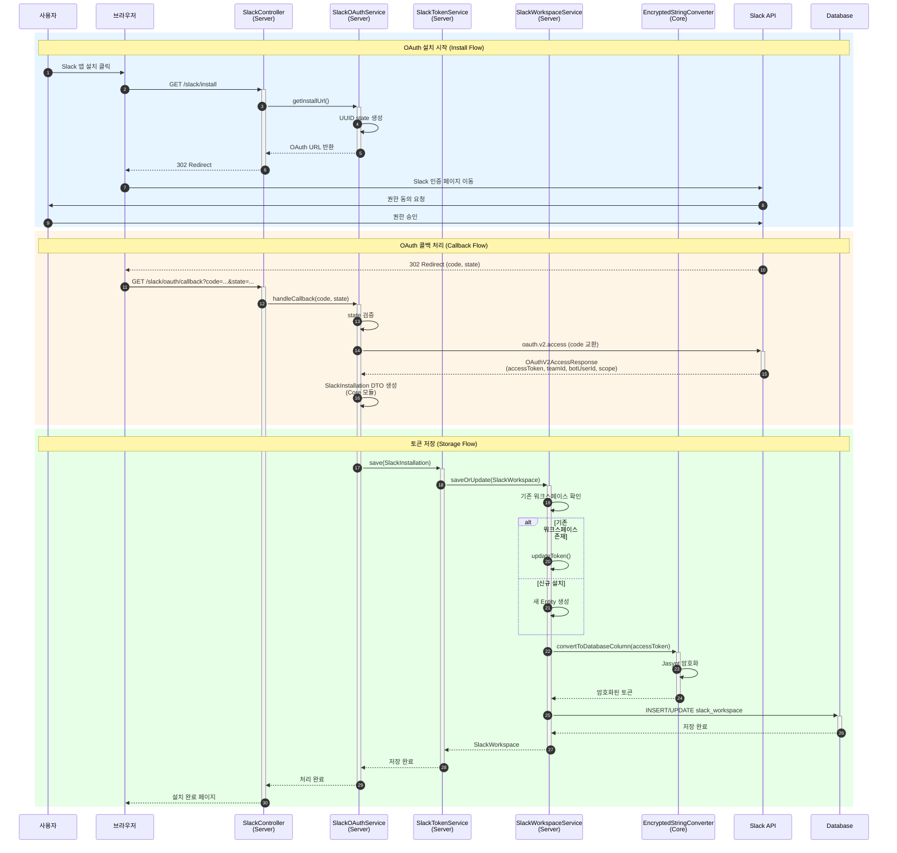

# Slack OAuth Sequence Diagram

Slack OAuth 연동 과정을 모듈별로 정리한 시퀀스 다이어그램

## Sequence Diagram (현재 구조)

## 모듈별 역할 (현재)

| 모듈 | 컴포넌트 | 역할 |
|------|----------|------|
| **Server** | `SlackController` | REST 엔드포인트 제공 (`/slack/install`, `/slack/oauth/callback`) |
| **Server** | `SlackOAuthService` | OAuth 흐름 처리, Slack API 호출, 토큰 교환 |
| **Server** | `SlackTokenService` | `SlackTokenProvider` 구현, 저장 로직 위임 |
| **Server** | `SlackWorkspaceService` | 워크스페이스 비즈니스 로직 (신규/갱신 판단) |
| **Core** | `SlackInstallation` | 설치 정보 전달용 DTO (Record) |
| **Core** | `SlackTokenProvider` | 토큰 저장/조회 인터페이스 |
| **Core** | `EncryptedStringConverter` | accessToken 암호화/복호화 |

## 주요 파일 위치 (현재)

### Core 모듈
- `dop-global-apps-core/src/main/java/com/daou/dop/global/apps/core/slack/SlackTokenProvider.java`
- `dop-global-apps-core/src/main/java/com/daou/dop/global/apps/core/slack/SlackInstallation.java`
- `dop-global-apps-core/src/main/java/com/daou/dop/global/apps/core/slack/EncryptedStringConverter.java`

### Server 모듈
- `dop-global-apps-server/src/main/java/com/daou/dop/global/apps/server/slack/SlackController.java`
- `dop-global-apps-server/src/main/java/com/daou/dop/global/apps/server/slack/SlackOAuthService.java`
- `dop-global-apps-server/src/main/java/com/daou/dop/global/apps/server/slack/SlackTokenService.java`
- `dop-global-apps-server/src/main/java/com/daou/dop/global/apps/server/slack/SlackWorkspaceService.java`

## 엔드포인트 (현재)

| Method | Path | 설명 |
|--------|------|------|
| GET | `/slack/install` | OAuth 설치 시작 |
| GET | `/slack/oauth/callback` | OAuth 콜백 처리 |

---

## 개선안

개선된 플러그인 아키텍처 설계는 [SLACK_OAUTH_SEQUENCE_V2.md](./SLACK_OAUTH_SEQUENCE_V2.md) 참고
