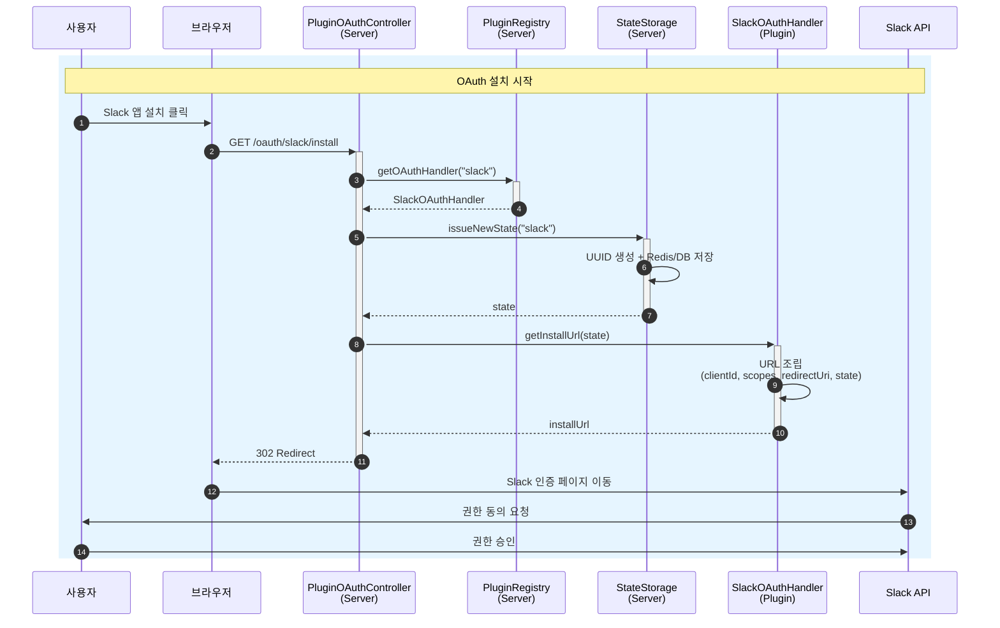
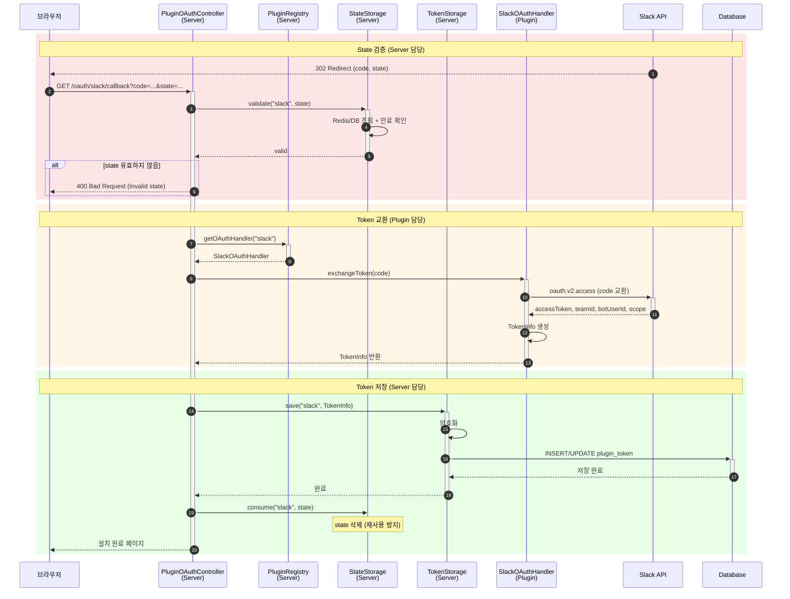
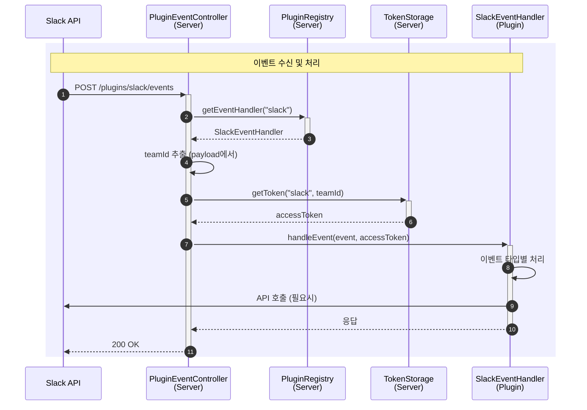

# Slack OAuth Sequence Diagram V2

개선된 플러그인 아키텍처 기반 OAuth 연동 설계

---

## 기존 대비 발전된 점

| 항목 | 기존 (V1) | 개선 (V2) |
|------|-----------|-----------|
| Server 결합도 | Slack 전용 코드 하드코딩 | 범용 플러그인 구조 |
| Plugin 역할 | 이벤트 핸들러만 등록 | OAuth, 이벤트 전체 담당 |
| 확장성 | 새 서비스 추가 시 Server 수정 | Plugin만 추가하면 됨 |
| state 관리 | **생성만 하고 저장/검증 누락** | Server가 저장/검증 담당 |
| 보안 | CSRF 취약점 존재 | state 검증으로 CSRF 방지 |

---

## 현재 구조 문제점

### 1. Server-Slack 강결합

```
Server 모듈 (현재)
├── SlackController         ← Slack 전용
├── SlackOAuthService       ← Slack 전용
├── SlackBoltAdapter        ← Slack 전용
├── SlackTokenService       ← Slack 전용
└── SlackWorkspace          ← Slack 전용
```

### 2. Plugin 역할 부재

- Plugin은 이벤트 핸들러만 등록
- OAuth, 토큰 저장 등 핵심 로직이 Server에 위치
- 플러그인 아키텍처의 의미 없음

### 3. state 저장/검증 누락 (보안 취약점)

```java
// 현재 SlackOAuthService.java
public String getInstallUrl() {
    String state = UUID.randomUUID().toString();  // 생성만 함
    return OAUTH_AUTHORIZE_URL + "...&state=" + state;
    // ❌ 저장 없음
}

public void handleCallback(String code, String state) {
    // ❌ state 검증 없이 무시
    OAuthV2AccessResponse response = slack.methods().oauthV2Access(...);
}
```

**CSRF 공격 가능** - 악의적인 사용자가 임의의 code로 콜백 요청 가능

### 4. Bolt SDK 미활용

Slack Bolt SDK는 `OAuthStateService` 인터페이스를 제공하지만 미사용:
- `InstallationService` - 구현됨 (DatabaseInstallationService)
- `OAuthStateService` - **미구현**

---

## 개선된 구조

### 모듈별 책임

| 모듈 | 컴포넌트 | 역할 |
|------|----------|------|
| **Server** | `PluginOAuthController` | 범용 OAuth 엔드포인트 |
| **Server** | `PluginEventController` | 범용 이벤트 엔드포인트 |
| **Server** | `PluginRegistry` | 플러그인 조회 및 라우팅 |
| **Server** | `StateStorage` | state 생성/저장/검증 (Redis/DB) |
| **Server** | `TokenStorage` | 토큰 저장소 (pluginId 기반) |
| **Core** | `OAuthHandler` | OAuth 처리 인터페이스 |
| **Core** | `EventHandler` | 이벤트 처리 인터페이스 |
| **Core** | `TokenInfo` | 토큰 정보 DTO |
| **Plugin** | `SlackOAuthHandler` | Slack OAuth 로직 (URL 생성, 토큰 교환) |
| **Plugin** | `SlackEventHandler` | Slack 이벤트 처리 |

### 핵심 원칙

```
State 관리:
  Server → state 생성/저장/검증 (인프라 담당)
  Plugin → state를 받아서 URL 조립

Token 관리:
  Plugin → Slack API 호출하여 토큰 교환
  Plugin → Server로 TokenInfo 반환
  Server → TokenStorage에 저장

Event 처리:
  Server → 토큰 조회하여 Plugin에 전달
  Plugin → 이벤트 처리 및 API 호출
```

---

## Sequence Diagram

### 1. OAuth Install Flow



### 2. OAuth Callback Flow



### 3. Event Processing Flow



---

## 엔드포인트

| Method | Path | 설명 |
|--------|------|------|
| GET | `/oauth/{plugin}/install` | OAuth 설치 시작 |
| GET | `/oauth/{plugin}/callback` | OAuth 콜백 처리 |
| POST | `/plugins/{plugin}/events` | 이벤트 수신 |
| POST | `/plugins/{plugin}/commands` | 슬래시 커맨드 |
| POST | `/plugins/{plugin}/interactions` | 인터랙션 |

---

## Core 인터페이스

### OAuthHandler

```java
/**
 * OAuth 처리 인터페이스 - Plugin이 구현
 */
public interface OAuthHandler extends ExtensionPoint {

    /** 플러그인 ID */
    String getPluginId();

    /**
     * OAuth 설치 URL 생성
     * @param state Server가 생성한 state
     * @return 완성된 OAuth URL
     */
    String getInstallUrl(String state);

    /**
     * Authorization code를 token으로 교환
     * @param code Slack에서 받은 authorization code
     * @return 토큰 정보
     */
    TokenInfo exchangeToken(String code);
}
```

### EventHandler

```java
/**
 * 이벤트 처리 인터페이스 - Plugin이 구현
 */
public interface EventHandler extends ExtensionPoint {

    /** 플러그인 ID */
    String getPluginId();

    /**
     * 이벤트 처리
     * @param event 이벤트 데이터
     * @param accessToken Server가 조회한 토큰
     * @return 응답
     */
    EventResponse handleEvent(EventRequest event, String accessToken);
}
```

### StateStorage

```java
/**
 * State 저장소 인터페이스 - Server가 구현
 */
public interface StateStorage {

    /**
     * 새 state 발급 및 저장
     * @param pluginId 플러그인 ID
     * @return 생성된 state
     */
    String issueNewState(String pluginId);

    /**
     * state 검증
     * @param pluginId 플러그인 ID
     * @param state 검증할 state
     * @return 유효 여부
     */
    boolean validate(String pluginId, String state);

    /**
     * state 소비 (삭제)
     * @param pluginId 플러그인 ID
     * @param state 삭제할 state
     */
    void consume(String pluginId, String state);

    /** state 만료 시간 (초) */
    default long getExpirationInSeconds() {
        return 600; // 10분
    }
}
```

### TokenInfo

```java
/**
 * 토큰 정보 DTO
 */
public record TokenInfo(
    String pluginId,
    String teamId,
    String teamName,
    String accessToken,
    String botUserId,
    String scope,
    Instant installedAt
) {
    public static Builder builder() {
        return new Builder();
    }
}
```

---

## 파일 구조

```
dop-global-apps-core/
└── com.daou.dop.global.apps.core
    ├── oauth/
    │   ├── OAuthHandler.java        # OAuth 인터페이스
    │   ├── StateStorage.java        # State 저장소 인터페이스
    │   └── TokenInfo.java           # 토큰 DTO
    ├── event/
    │   ├── EventHandler.java        # 이벤트 인터페이스
    │   ├── EventRequest.java        # 이벤트 요청 DTO
    │   └── EventResponse.java       # 이벤트 응답 DTO
    └── token/
        └── TokenStorage.java        # 토큰 저장소 인터페이스

dop-global-apps-server/
└── com.daou.dop.global.apps.server
    ├── plugin/
    │   ├── PluginOAuthController.java   # 범용 OAuth 컨트롤러
    │   ├── PluginEventController.java   # 범용 이벤트 컨트롤러
    │   └── PluginRegistry.java          # 플러그인 조회
    ├── oauth/
    │   └── RedisStateStorage.java       # StateStorage 구현 (Redis)
    ├── token/
    │   └── JpaTokenStorage.java         # TokenStorage 구현 (JPA)
    └── entity/
        └── PluginToken.java             # 범용 토큰 Entity

plugins/slack-plugin/
└── com.daou.dop.global.apps.plugin.slack
    ├── SlackOAuthHandler.java       # OAuthHandler 구현
    ├── SlackEventHandler.java       # EventHandler 구현
    ├── SlackProperties.java         # Slack 설정 (clientId, secret 등)
    └── handler/
        ├── MessageHandler.java      # 메시지 이벤트 처리
        └── CommandHandler.java      # 슬래시 커맨드 처리
```

---

## State 저장소 구현 옵션

| 구현체 | 장점 | 단점 |
|--------|------|------|
| `RedisStateStorage` | 빠름, TTL 지원, 분산 환경 | Redis 인프라 필요 |
| `JdbcStateStorage` | 별도 인프라 불필요 | 만료 처리 별도 구현 |
| `InMemoryStateStorage` | 간단, 테스트용 | 서버 재시작 시 유실, 분산 불가 |

**권장:** `RedisStateStorage` (운영), `InMemoryStateStorage` (로컬/테스트)
