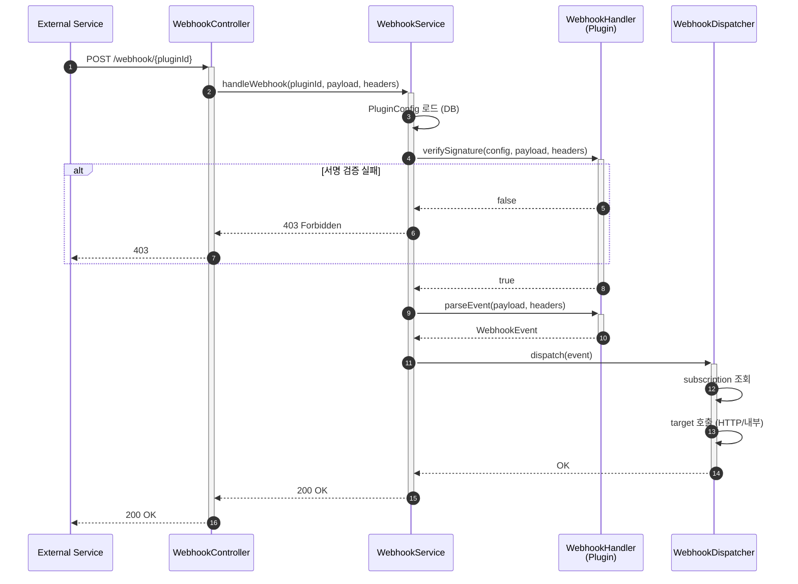

# 플러그인 웹훅 설계

## 개요

외부 서비스 → Server 방향의 웹훅 수신 및 처리 아키텍처

> **관련 문서**: [플러그인 인터페이스 설계](PLUGIN.md) - OAuth, API 실행

---

## 1. 현재 구조와 웹훅 추가

### 1.1 기존: 아웃바운드 중심

```
┌────────┐         ┌────────┐         ┌─────────┐
│ Server │ ──────▶ │ Plugin │ ──────▶ │ External│
└────────┘ Execute └────────┘   API   └─────────┘
```

### 1.2 웹훅 추가: 인바운드 흐름

```
┌─────────┐         ┌────────┐         ┌────────┐
│ External│ ──────▶ │ Server │ ──────▶ │ Plugin │
└─────────┘ Webhook └────────┘  Parse  └────────┘
                         │
                         ▼
                   ┌────────────┐
                   │ Dispatcher │
                   │  - HTTP    │
                   │  - 내부    │
                   └────────────┘
```

---

## 2. 설계 원칙

### 2.1 동기 처리

- 웹훅 수신 → 검증 → 파싱 → 디스패치 순차 처리
- 구독 기반으로 HTTP/내부 메서드 호출

### 2.2 플러그인 책임 분리

- **플러그인**: 검증, 파싱, 즉시응답 판단
- **서버**: 흐름 제어, MQ 발행, 후처리 로직

---

## 3. 연동 식별 (Connection Resolution)

웹훅 수신 시 **어떤 고객사(connection)의 이벤트인지** 식별 필요

### 3.1 식별 방법

```
┌─────────────────────────────────────────────────────────────────┐
│                      식별 방법 3가지                              │
├─────────────────────────────────────────────────────────────────┤
│  1. 페이로드 내 식별자 (가장 일반적)                               │
│     - Slack: team_id, GitHub: repository.id                     │
│     - 서버가 plugin_id + external_id로 connection 조회           │
│                                                                 │
│  2. URL 경로에 식별자 포함                                        │
│     - /webhook/slack/{connectionId}                             │
│     - 웹훅 등록 시 connection별 고유 URL 발급                     │
│                                                                 │
│  3. 채널/리소스 ID (Google Calendar 등)                          │
│     - 웹훅 구독 시 반환된 channel_id, resource_id 저장            │
│     - 헤더에서 추출하여 매칭                                      │
└─────────────────────────────────────────────────────────────────┘
```

### 3.2 권장 설계: 방법 1 + 2 조합

```
엔드포인트:
  POST /webhook/{pluginId}                  ← 기본 (페이로드에서 식별)
  POST /webhook/{pluginId}/{connectionId}   ← 명시적 (URL에서 식별)

처리 흐름:
  1. connectionId 있으면 → 바로 connection 조회
  2. 없으면 → extractExternalId() → plugin_id + external_id로 조회
```

### 3.3 WebhookHandler 확장

```java
public interface WebhookHandler extends ExtensionPoint {

    // ... 기존 메서드 ...

    /**
     * 페이로드에서 외부 식별자 빠르게 추출
     * connection 조회용 (parseEvent 전에 호출 가능)
     *
     * @return externalId (Slack: teamId, GitHub: repositoryId 등)
     */
    String extractExternalId(String rawPayload, Map<String, String> headers);
}
```

### 3.4 WebhookService 수정

```java
public WebhookResult handleWebhook(
        String pluginId,
        String connectionId,  // nullable (URL path variable)
        byte[] payload,
        Map<String, String> headers) {

    String rawPayload = new String(payload, UTF_8);

    // 1. Connection 조회
    PluginConnection connection;
    if (connectionId != null) {
        // URL에 connectionId 있으면 바로 조회
        connection = connectionRepository.findById(connectionId)
            .orElseThrow(() -> new ConnectionNotFoundException(connectionId));
    } else {
        // 페이로드에서 externalId 추출
        String externalId = handler.extractExternalId(rawPayload, headers);
        connection = connectionRepository
            .findByPluginIdAndExternalId(pluginId, externalId)
            .orElseThrow(() -> new ConnectionNotFoundException(pluginId, externalId));
    }

    // 2. Connection의 Plugin 설정으로 서명 검증
    PluginConfig config = toPluginConfig(connection.getPlugin());
    if (!handler.verifySignature(config, payload, headers)) {
        return WebhookResult.forbidden("Invalid signature");
    }

    // 3. 이벤트 파싱 + connection 정보 enrichment
    WebhookEvent event = handler.parseEvent(rawPayload, headers)
        .withConnection(connection.getId(), connection.getCompanyId());

    // 4. 이후 처리 (즉시 응답 확인, MQ 발행)
    // ...
}
```

### 3.5 WebhookEvent 확장

```java
public record WebhookEvent(
    String pluginId,
    String eventType,
    String externalId,
    String externalUserId,
    Instant timestamp,
    Map<String, Object> data,

    // Connection 정보 (서버에서 enrichment)
    Long connectionId,          // 연동 ID
    Long companyId              // 고객사 ID
) {
    public WebhookEvent withConnection(Long connectionId, Long companyId) {
        return new WebhookEvent(
            pluginId, eventType, externalId, externalUserId,
            timestamp, data, connectionId, companyId
        );
    }
}
```

---

## 4. 웹훅 처리 흐름



---

## 5. 핵심 인터페이스

### 5.1 WebhookHandler (plugin-sdk)

```java
/**
 * 웹훅 처리 인터페이스
 * 플러그인에서 구현
 */
public interface WebhookHandler extends ExtensionPoint {

    /**
     * 플러그인 ID
     */
    String getPluginId();

    /**
     * 웹훅 서명 검증
     *
     * @param config 플러그인 설정 (secrets.signing_secret 등)
     * @param payload 원본 페이로드 (바이트)
     * @param headers HTTP 헤더
     * @return 검증 성공 여부
     */
    boolean verifySignature(PluginConfig config, byte[] payload, Map<String, String> headers);

    /**
     * 이벤트 파싱
     *
     * @param rawPayload 원본 JSON
     * @param headers HTTP 헤더
     * @return 파싱된 이벤트
     */
    WebhookEvent parseEvent(String rawPayload, Map<String, String> headers);

    /**
     * 즉시 응답 필요 여부 및 응답 내용
     *
     * @param event 파싱된 이벤트
     * @param rawPayload 원본 페이로드 (challenge 추출용)
     * @return 즉시 응답 필요 시 Optional.of(), 아니면 empty()
     */
    Optional<WebhookImmediateResponse> getImmediateResponse(WebhookEvent event, String rawPayload);
}
```

### 5.2 WebhookEvent (plugin-sdk)

```java
/**
 * 파싱된 웹훅 이벤트
 * MQ로 발행되는 메시지 페이로드
 */
public record WebhookEvent(
    String pluginId,                // slack, github, google-calendar
    String eventType,               // message, push, calendar.event.created
    String externalId,              // teamId, repositoryId, calendarId
    String externalUserId,          // 이벤트 발생 사용자 (nullable)
    Instant timestamp,              // 이벤트 발생 시간
    Map<String, Object> data        // 이벤트 상세 데이터
) {}
```

### 5.3 WebhookImmediateResponse (plugin-sdk)

```java
/**
 * 즉시 응답이 필요한 경우 사용
 */
public record WebhookImmediateResponse(
    int statusCode,
    String contentType,
    String body
) {
    public static WebhookImmediateResponse json(String body) {
        return new WebhookImmediateResponse(200, "application/json", body);
    }

    public static WebhookImmediateResponse text(String body) {
        return new WebhookImmediateResponse(200, "text/plain", body);
    }

    public static WebhookImmediateResponse ok() {
        return new WebhookImmediateResponse(200, null, null);
    }
}
```

---

## 6. 플러그인 구현 예시

### 6.1 SlackWebhookHandler

```java
@Extension
public class SlackWebhookHandler implements WebhookHandler {

    private static final String PLUGIN_ID = "slack";

    @Override
    public String getPluginId() {
        return PLUGIN_ID;
    }

    @Override
    public boolean verifySignature(PluginConfig config, byte[] payload, Map<String, String> headers) {
        String signingSecret = config.getSecret("signing_secret");
        String signature = headers.get("X-Slack-Signature");
        String timestamp = headers.get("X-Slack-Request-Timestamp");

        // 타임스탬프 검증 (5분 이내)
        long ts = Long.parseLong(timestamp);
        if (Math.abs(Instant.now().getEpochSecond() - ts) > 300) {
            return false;
        }

        // HMAC-SHA256 서명 검증
        String baseString = "v0:" + timestamp + ":" + new String(payload, UTF_8);
        String expected = "v0=" + hmacSha256(signingSecret, baseString);

        return MessageDigest.isEqual(signature.getBytes(), expected.getBytes());
    }

    @Override
    public WebhookEvent parseEvent(String rawPayload, Map<String, String> headers) {
        JsonNode json = parseJson(rawPayload);
        String type = json.path("type").asText();

        // Event API
        if ("event_callback".equals(type)) {
            JsonNode event = json.path("event");
            return new WebhookEvent(
                PLUGIN_ID,
                event.path("type").asText(),           // message, reaction_added, etc.
                json.path("team_id").asText(),
                event.path("user").asText(),
                Instant.ofEpochSecond(json.path("event_time").asLong()),
                Map.of("event", toMap(event))
            );
        }

        // Interactive Components
        if (headers.containsKey("X-Slack-Interaction")) {
            return new WebhookEvent(
                PLUGIN_ID,
                "interaction",
                json.path("team").path("id").asText(),
                json.path("user").path("id").asText(),
                Instant.now(),
                Map.of("payload", toMap(json))
            );
        }

        // URL Verification (이벤트로 변환하지 않음)
        return new WebhookEvent(PLUGIN_ID, type, null, null, Instant.now(), Map.of());
    }

    @Override
    public Optional<WebhookImmediateResponse> getImmediateResponse(WebhookEvent event, String rawPayload) {
        // URL Verification
        if ("url_verification".equals(event.eventType())) {
            JsonNode json = parseJson(rawPayload);
            String challenge = json.path("challenge").asText();
            return Optional.of(WebhookImmediateResponse.json("{\"challenge\":\"" + challenge + "\"}"));
        }

        // Interactive Components - 빈 응답 (3초 내)
        if ("interaction".equals(event.eventType())) {
            return Optional.of(WebhookImmediateResponse.ok());
        }

        return Optional.empty();
    }
}
```

### 6.2 GitHubWebhookHandler

```java
@Extension
public class GitHubWebhookHandler implements WebhookHandler {

    private static final String PLUGIN_ID = "github";

    @Override
    public String getPluginId() {
        return PLUGIN_ID;
    }

    @Override
    public boolean verifySignature(PluginConfig config, byte[] payload, Map<String, String> headers) {
        String secret = config.getSecret("webhook_secret");
        String signature = headers.get("X-Hub-Signature-256");

        if (signature == null || !signature.startsWith("sha256=")) {
            return false;
        }

        String expected = "sha256=" + hmacSha256(secret, new String(payload, UTF_8));
        return MessageDigest.isEqual(signature.getBytes(), expected.getBytes());
    }

    @Override
    public WebhookEvent parseEvent(String rawPayload, Map<String, String> headers) {
        String eventType = headers.get("X-GitHub-Event");
        JsonNode json = parseJson(rawPayload);

        return new WebhookEvent(
            PLUGIN_ID,
            eventType,                                      // push, pull_request, issues
            json.path("repository").path("id").asText(),
            json.path("sender").path("login").asText(),
            Instant.now(),
            Map.of("payload", toMap(json))
        );
    }

    @Override
    public Optional<WebhookImmediateResponse> getImmediateResponse(WebhookEvent event, String rawPayload) {
        // ping 이벤트
        if ("ping".equals(event.eventType())) {
            return Optional.of(WebhookImmediateResponse.json("{\"message\":\"pong\"}"));
        }
        return Optional.empty();
    }
}
```

---

## 7. 서버 측 구현

### 7.1 WebhookController (api)

```java
@RestController
@RequestMapping("/webhook")
@RequiredArgsConstructor
public class WebhookController {

    private final WebhookService webhookService;

    @PostMapping("/{pluginId}")
    public ResponseEntity<String> handleWebhook(
            @PathVariable String pluginId,
            @RequestBody byte[] payload,
            @RequestHeader Map<String, String> headers) {

        WebhookResult result = webhookService.handleWebhook(pluginId, payload, headers);

        return ResponseEntity
            .status(result.statusCode())
            .contentType(MediaType.parseMediaType(
                result.contentType() != null ? result.contentType() : "application/json"))
            .body(result.body());
    }
}
```

### 7.2 WebhookService (core)

```java
@Service
@RequiredArgsConstructor
public class WebhookService {

    private final PluginRepository pluginRepository;
    private final PluginManager pluginManager;
    private final WebhookDispatcher dispatcher;

    public WebhookResult handleWebhook(String pluginId, byte[] payload, Map<String, String> headers) {
        // 1. 플러그인 설정 로드
        Plugin plugin = pluginRepository.findByPluginId(pluginId)
            .orElseThrow(() -> new PluginNotFoundException(pluginId));

        PluginConfig config = toPluginConfig(plugin);

        // 2. WebhookHandler 조회
        WebhookHandler handler = pluginManager.getExtensions(WebhookHandler.class).stream()
            .filter(h -> h.getPluginId().equals(pluginId))
            .findFirst()
            .orElseThrow(() -> new WebhookHandlerNotFoundException(pluginId));

        // 3. 서명 검증
        if (!handler.verifySignature(config, payload, headers)) {
            return WebhookResult.forbidden("Invalid signature");
        }

        // 4. 이벤트 파싱
        String rawPayload = new String(payload, StandardCharsets.UTF_8);
        WebhookEvent event = handler.parseEvent(rawPayload, headers);

        // 5. 디스패치
        dispatcher.dispatch(event);

        return WebhookResult.ok();
    }
}
```

---

## 8. 웹훅 구독 관리

### 8.1 webhook_subscription 테이블

```sql
CREATE TABLE webhook_subscription (
    id              BIGSERIAL PRIMARY KEY,

    -- 매칭 조건
    plugin_id       VARCHAR(50) NOT NULL,           -- slack, github
    event_type      VARCHAR(100),                   -- message, push (null = 전체)
    connection_id   BIGINT REFERENCES plugin_connection(id),  -- 특정 연동만 (null = 전체)

    -- 타겟 정보
    target_type     VARCHAR(20) NOT NULL,           -- HTTP, INTERNAL
    target_url      VARCHAR(500),                   -- HTTP 호출 시
    target_method   VARCHAR(100),                   -- INTERNAL 메서드

    -- 설정
    filter_expr     TEXT,                           -- JSONPath 필터 (선택)
    transform_expr  TEXT,                           -- 변환 표현식 (선택)
    retry_policy    JSONB,                          -- 재시도 정책

    -- 상태
    enabled         BOOLEAN DEFAULT true,
    created_at      TIMESTAMP DEFAULT CURRENT_TIMESTAMP,
    updated_at      TIMESTAMP DEFAULT CURRENT_TIMESTAMP
);

CREATE INDEX idx_webhook_sub_plugin_event ON webhook_subscription(plugin_id, event_type);
CREATE INDEX idx_webhook_sub_connection ON webhook_subscription(connection_id);
```

### 8.2 target_type 설명

| type     | 용도                  | 예시                              |
| -------- | --------------------- | --------------------------------- |
| HTTP     | 외부/내부 서비스 호출 | `https://api.example.com/webhook` |
| INTERNAL | 내부 메서드 호출      | `NotificationService.send`        |

### 8.3 retry_policy 예시

```json
{
  "maxAttempts": 3,
  "backoffType": "EXPONENTIAL",
  "initialInterval": 1000,
  "maxInterval": 60000,
  "multiplier": 2.0
}
```

---

## 9. 웹훅 Dispatcher

### 9.1 WebhookDispatcher

```java
@Component
@RequiredArgsConstructor
public class WebhookDispatcher {

    private final WebhookSubscriptionRepository subscriptionRepository;
    private final RestTemplate restTemplate;
    private final ApplicationContext applicationContext;

    public void dispatch(WebhookEvent event) {
        // 1. 매칭되는 구독 조회
        List<WebhookSubscription> subscriptions = subscriptionRepository
            .findMatchingSubscriptions(event.pluginId(), event.eventType(), event.externalId());

        // 2. 각 구독에 대해 디스패치
        for (WebhookSubscription sub : subscriptions) {
            if (matchesFilter(sub, event)) {
                dispatchToTarget(sub, event);
            }
        }
    }

    private boolean matchesFilter(WebhookSubscription sub, WebhookEvent event) {
        if (sub.getFilterExpr() == null) {
            return true;
        }
        // JSONPath 필터 적용
        return JsonPathEvaluator.evaluate(sub.getFilterExpr(), event.data());
    }

    private void dispatchToTarget(WebhookSubscription sub, WebhookEvent event) {
        Object payload = transform(sub, event);

        switch (sub.getTargetType()) {
            case HTTP -> dispatchHttp(sub, payload);
            case INTERNAL -> dispatchInternal(sub, payload);
        }
    }

    private void dispatchHttp(WebhookSubscription sub, Object payload) {
        restTemplate.postForEntity(sub.getTargetUrl(), payload, Void.class);
    }

    private void dispatchInternal(WebhookSubscription sub, Object payload) {
        // "NotificationService.send" → NotificationService 빈의 send 메서드 호출
        String[] parts = sub.getTargetMethod().split("\\.");
        Object bean = applicationContext.getBean(uncapitalize(parts[0]));
        // 리플렉션으로 메서드 호출
    }
}
```

---

## 10. 보안 고려사항

### 10.1 서명 검증 필수

- 모든 웹훅은 서명 검증 통과 필수
- 검증 실패 시 403 Forbidden
- 타임스탬프 검증으로 리플레이 공격 방지

### 10.2 Rate Limiting

```java
@Component
public class WebhookRateLimiter {

    private final RateLimiter rateLimiter = RateLimiter.create(100); // 초당 100건

    public boolean tryAcquire(String pluginId) {
        // 플러그인별 rate limit 적용
        return rateLimiter.tryAcquire();
    }
}
```

### 10.3 페이로드 크기 제한

```yaml
# application.yml
spring:
  servlet:
    multipart:
      max-request-size: 1MB
```

---

## 11. 모니터링

### 11.1 메트릭

- `webhook.received.count{plugin, event_type}` - 수신 건수
- `webhook.verification.failed.count{plugin}` - 검증 실패 건수
- `webhook.dispatch.count{plugin, target_type}` - 디스패치 건수
- `webhook.dispatch.latency{plugin, target_type}` - 디스패치 지연시간

### 11.2 로깅

```java
@Slf4j
public class WebhookService {

    public WebhookResult handleWebhook(...) {
        log.info("Webhook received: plugin={}, size={}", pluginId, payload.length);

        // ... 처리 ...

        log.info("Webhook processed: plugin={}, event={}, immediate={}",
            pluginId, event.eventType(), immediateResponse.isPresent());
    }
}
```

---

## 12. 변경 이력

| 날짜       | 버전 | 내용                                         |
| ---------- | ---- | -------------------------------------------- |
| 2025-01-23 | 0.1  | 초안 작성                                    |
| 2025-01-23 | 0.2  | 연동 식별 섹션, 서비스별 웹훅 특성 부록 추가 |
| 2025-01-27 | 0.3  | MQ 제거, 동기 처리 방식으로 단순화           |

---

## 부록 A. 서비스별 웹훅 특성

### A.1 비교표

| 서비스              | 서명 검증          | 연동 식별자                 | 즉시 응답              | 특이사항            |
| ------------------- | ------------------ | --------------------------- | ---------------------- | ------------------- |
| **Slack**           | HMAC-SHA256        | `team_id` (페이로드)        | challenge, interaction | 5분 타임스탬프 검증 |
| **GitHub**          | HMAC-SHA256        | `repository.id` (페이로드)  | ping                   | 헤더에 이벤트 타입  |
| **Google Calendar** | 없음 (채널 토큰)   | `x-goog-channel-id` (헤더)  | 없음                   | 구독 갱신 필요      |
| **MS Graph**        | JWT + clientState  | `subscriptionId` (페이로드) | validationToken        | 복잡한 검증         |
| **Jira**            | HMAC-SHA256 (선택) | `webhookEvent` 내 ID        | 없음                   | 2024년 서명 추가    |
| **Zoom**            | HMAC-SHA256        | `account_id` (페이로드)     | challenge              | 72시간 재검증       |
| **Notion**          | HMAC-SHA256        | `workspace_id` (페이로드)   | 없음                   | 2024년 웹훅 추가    |

---

### A.2 Slack

**문서**: [Events API](https://api.slack.com/events-api), [서명 검증](https://api.slack.com/authentication/verifying-requests-from-slack)

```yaml
서명 검증:
  헤더: X-Slack-Signature, X-Slack-Request-Timestamp
  알고리즘: HMAC-SHA256
  포맷: v0={signature}
  base_string: "v0:{timestamp}:{body}"
  주의: 타임스탬프 5분 이내 검증 필수

연동 식별:
  위치: 페이로드 body.team_id
  예시: "T1234567890"

즉시 응답:
  - url_verification: {"challenge": "..."} 리턴 필수
  - interactive: 3초 내 200 OK 필수 (빈 응답 가능)

페이로드 예시:
  {
    "type": "event_callback",
    "team_id": "T1234567890",
    "event": {
      "type": "message",
      "user": "U1234567890",
      "text": "Hello",
      "channel": "C1234567890"
    }
  }

재시도:
  - 실패 시 3회 재시도 (즉시, 1분, 5분)
  - Rate limit: 30,000 events/hour/workspace
```

---

### A.3 GitHub

**문서**: [Webhooks](https://docs.github.com/en/webhooks)

```yaml
서명 검증:
  헤더: X-Hub-Signature-256
  알고리즘: HMAC-SHA256
  포맷: sha256={signature}
  base_string: body 전체

연동 식별:
  위치: 페이로드
  옵션:
    - repository.id (repo 이벤트)
    - organization.id (org 이벤트)
    - installation.id (GitHub App)

즉시 응답:
  - ping 이벤트: 설정 시 연결 확인용

이벤트 타입:
  헤더: X-GitHub-Event
  예시: push, pull_request, issues, workflow_run

페이로드 예시:
  {
    "action": "opened",
    "repository": { "id": 123456789, "full_name": "owner/repo" },
    "sender": { "login": "username" },
  }
```

---

### A.4 Google Calendar

**문서**: [Push Notifications](https://developers.google.com/calendar/api/guides/push)

```yaml
서명 검증:
  방식: 채널 토큰 (서명 없음)
  헤더: X-Goog-Channel-Token (등록 시 설정한 값)
  주의: 서명 대신 채널 토큰으로 검증

연동 식별:
  헤더:
    - X-Goog-Channel-ID: 등록 시 지정한 채널 ID
    - X-Goog-Resource-ID: Google이 반환한 리소스 ID
  주의: 페이로드에 상세 정보 없음 (변경 알림만)

즉시 응답:
  없음 (200 OK만 필요)

특이사항:
  - 웹훅은 "무엇이 변경됐는지" 알려주지 않음
  - 변경 알림 수신 후 API로 직접 조회 필요
  - 채널 만료 시간 있음 (갱신 필요)

페이로드:
  (거의 비어있음 - 헤더에 정보)

구독 등록:
  POST /calendar/v3/calendars/{calendarId}/events/watch
  {
    "id": "my-channel-id",
    "type": "web_hook",
    "address": "https://example.com/webhook/google-calendar",
    "token": "my-secret-token"  // 검증용
  }

구독 응답:
  {
    "id": "my-channel-id",
    "resourceId": "ret08u3rv24htgh289g",  // DB에 저장
    "expiration": "1426325213000"          // 만료 시간
  }
```

---

### A.5 Microsoft Graph (Teams, Outlook 등)

**문서**: [Change Notifications](https://learn.microsoft.com/en-us/graph/change-notifications-overview)

```yaml
서명 검증:
  방식: 복합 (clientState + JWT)
  1단계: clientState 값 확인
  2단계: (Rich Notifications) JWT 토큰 검증

연동 식별:
  위치: 페이로드 value[].subscriptionId
  주의: 구독 생성 시 반환된 ID를 DB에 저장

즉시 응답 (구독 생성 시):
  - validationToken 쿼리 파라미터를 plain text로 리턴
  - Content-Type: text/plain
  - 10초 이내 응답 필수

페이로드 예시:
  {
    "value": [
      {
        "subscriptionId": "subscription-id",
        "clientState": "my-secret-state",
        "changeType": "created",
        "resource": "Users/user-id/Messages/message-id",
        "resourceData": { ... }
      }
    ]
  }

구독 생성:
  POST /subscriptions
  {
    "changeType": "created,updated",
    "notificationUrl": "https://example.com/webhook/ms-graph",
    "resource": "/me/messages",
    "clientState": "my-secret-state",  // 검증용
    "expirationDateTime": "2024-01-01T00:00:00Z"
  }

특이사항:
  - 구독 만료 시간 있음 (최대 3일, 리소스마다 다름)
  - Rich Notifications는 JWT 검증 필요
```

---

### A.6 Jira (Atlassian)

**문서**: [Webhooks](https://developer.atlassian.com/cloud/jira/platform/webhooks/)

```yaml
서명 검증:
  헤더: X-Hub-Signature (2024년 추가)
  알고리즘: HMAC-SHA256
  포맷: sha256={signature}
  주의: 선택적 (secret 설정 시에만)

연동 식별:
  위치: 페이로드
  옵션:
    - issue.fields.project.id
    - webhookEvent (이벤트 타입)
    - user.accountId

즉시 응답: 없음 (200 OK만 필요)

페이로드 예시:
  {
    "webhookEvent": "jira:issue_created",
    "issue":
      {
        "id": "10001",
        "key": "PROJ-123",
        "fields": { "project": { "id": "10000" }, "summary": "Issue title" },
      },
    "user": { "accountId": "abc123" },
  }

특이사항:
  - Cloud와 Server/DC 동작 다름
  - Server/DC는 IP 화이트리스트 권장
```

---

### A.7 Zoom

**문서**: [Webhooks](https://developers.zoom.us/docs/api/webhooks/)

```yaml
서명 검증:
  헤더: x-zm-signature, x-zm-request-timestamp
  알고리즘: HMAC-SHA256
  포맷: v0={signature}
  base_string: "v0:{timestamp}:{body}"

연동 식별:
  위치: 페이로드 payload.account_id
  주의: 멀티 계정 시 account_id로만 구분 가능

즉시 응답:
  - endpoint.url_validation: challenge 값 해시하여 리턴
  - 72시간마다 재검증 요청 올 수 있음

검증 응답 예시:
  요청:
    { "event": "endpoint.url_validation", "payload": { "plainToken": "abc" } }
  응답: { "plainToken": "abc", "encryptedToken": "hmac(secret, abc)" }

페이로드 예시:
  {
    "event": "meeting.started",
    "payload":
      {
        "account_id": "abc123",
        "object": { "id": "123456789", "topic": "Meeting Topic" },
      },
  }

특이사항:
  - 2024년 2월부터 검증 필수
  - 멀티 계정 환경에서 secret 관리 복잡
```

---

### A.8 Notion

**문서**: [Webhooks](https://developers.notion.com/reference/webhooks)

```yaml
서명 검증:
  알고리즘: HMAC-SHA256
  주의: 선택적이지만 프로덕션 권장

연동 식별:
  위치: 페이로드 workspace_id
  예시: "workspace-uuid"

즉시 응답: 없음

페이로드 예시:
  {
    "type": "page.created",
    "workspace_id": "workspace-uuid",
    "data": { "page": { "id": "page-uuid", "properties": { ... } } },
  }

특이사항:
  - 2024년 네이티브 웹훅 추가
  - 유료 플랜만 지원
  - 자동화당 최대 5개 웹훅 액션
  - 페이지 콘텐츠는 전송 불가 (속성만)
```

---

### A.9 구현 우선순위 제안

| 우선순위 | 서비스          | 이유                      |
| -------- | --------------- | ------------------------- |
| 1        | Slack           | 가장 일반적, 문서화 잘 됨 |
| 2        | Google Calendar | 일정 동기화 니즈          |
| 3        | Jira            | 이슈 트래킹 연동          |
| 4        | MS Graph        | Teams/Outlook 연동 (복잡) |
| 5        | GitHub          | 개발 워크플로우 연동      |
| 6        | Zoom            | 미팅 이벤트               |
| 7        | Notion          | 문서 연동 (제한적)        |
