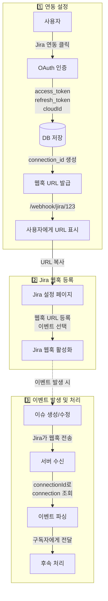
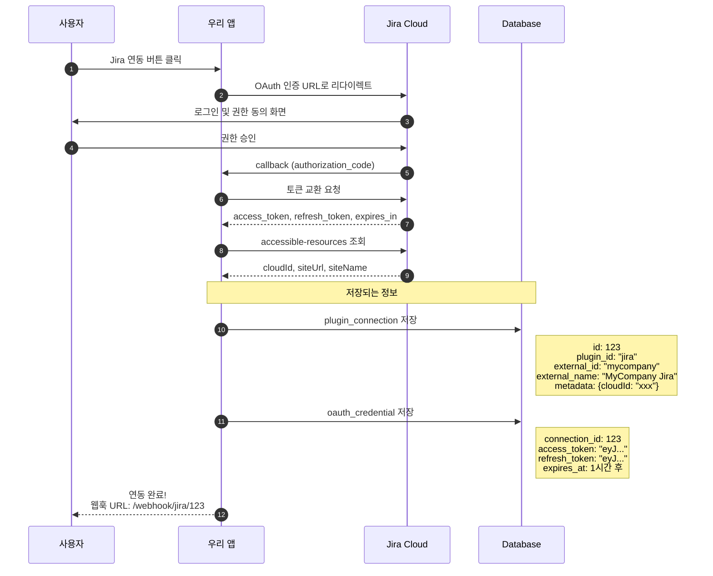
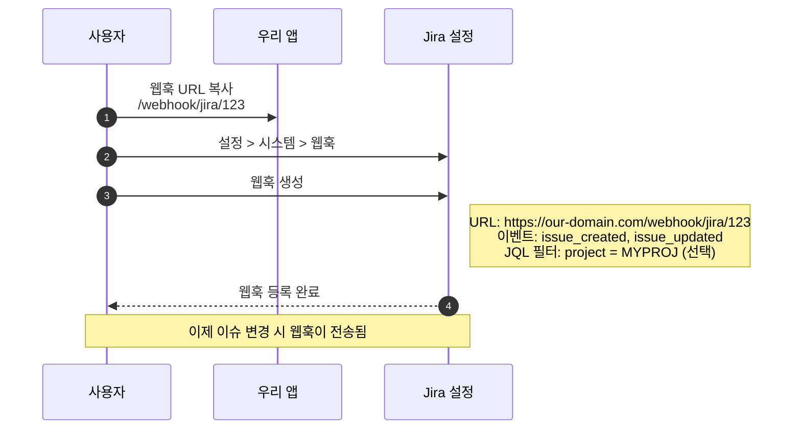
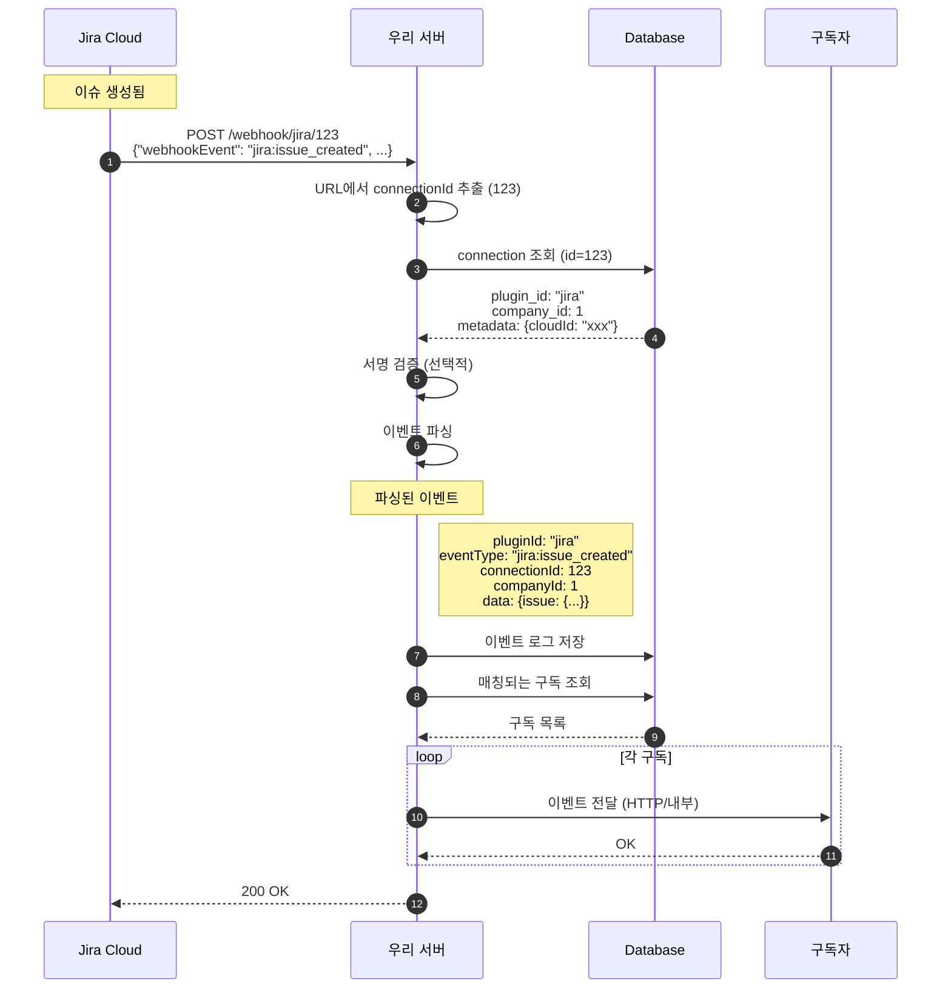
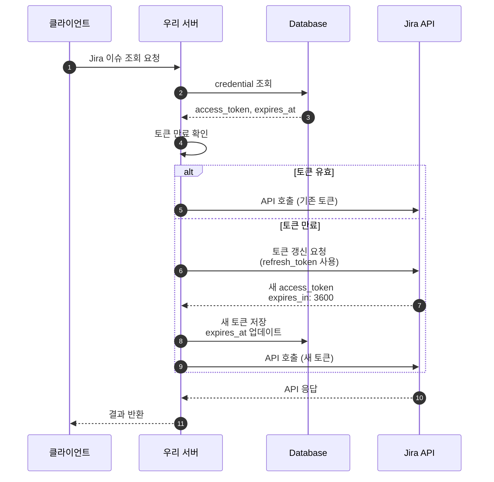
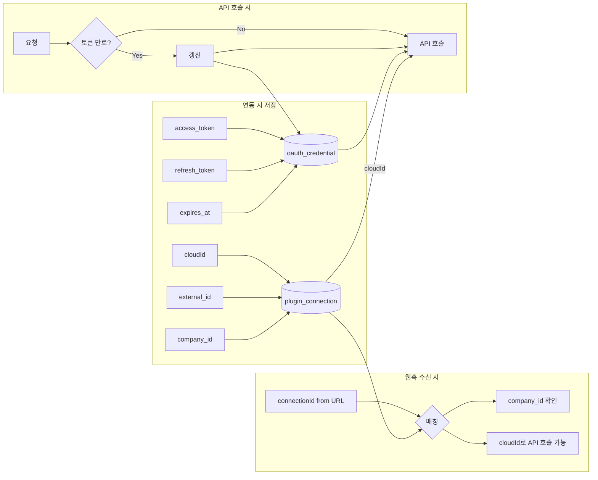

# 웹훅 비즈니스 흐름

## 전체 라이프사이클



---

## Phase 1: 연동 설정 상세



### 저장되는 데이터

| 테이블 | 필드 | 값 예시 | 용도 |
|--------|------|---------|------|
| `plugin_connection` | id | 123 | 웹훅 URL에 사용 |
| | plugin_id | "jira" | 플러그인 식별 |
| | external_id | "mycompany" | Jira 도메인 |
| | external_name | "MyCompany Jira" | 표시용 이름 |
| | metadata | {"cloudId": "xxx"} | API 호출 시 필요 |
| `oauth_credential` | access_token | "eyJ..." | API 인증 |
| | refresh_token | "eyJ..." | 토큰 갱신용 |
| | expires_at | 2025-01-28 15:00 | 만료 시점 |

---

## Phase 2: Jira에서 웹훅 등록



---

## Phase 3: 웹훅 수신 및 처리



---

## 토큰 자동 갱신 흐름



---

## 데이터 흐름 요약



---

## 핵심 매핑 관계

```
┌─────────────────────────────────────────────────────────────────┐
│                         웹훅 URL                                 │
│                                                                 │
│    /webhook/jira/123                                            │
│                   │                                             │
│                   └──▶ connectionId = 123                       │
│                                                                 │
├─────────────────────────────────────────────────────────────────┤
│                     plugin_connection                           │
│                                                                 │
│    id=123 ──▶ plugin_id="jira"                                  │
│           ──▶ external_id="mycompany" (Jira 도메인)             │
│           ──▶ company_id=1 (우리 시스템 고객사)                  │
│           ──▶ metadata.cloudId="xxx" (Jira API용)               │
│                                                                 │
├─────────────────────────────────────────────────────────────────┤
│                     oauth_credential                            │
│                                                                 │
│    connection_id=123 ──▶ access_token (API 호출용)              │
│                      ──▶ refresh_token (갱신용)                 │
│                      ──▶ expires_at (만료 시점)                 │
│                                                                 │
└─────────────────────────────────────────────────────────────────┘
```

---

## 변경 이력

| 날짜 | 내용 |
|------|------|
| 2025-01-28 | 초안 작성 |
